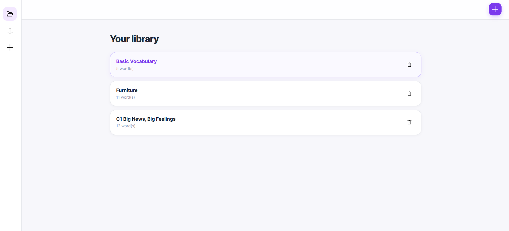
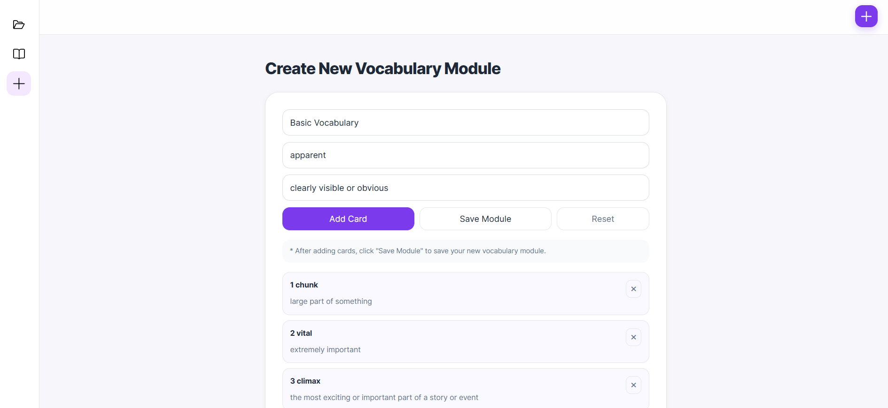
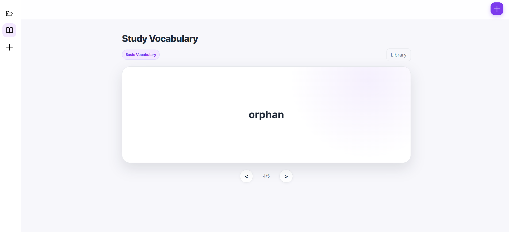
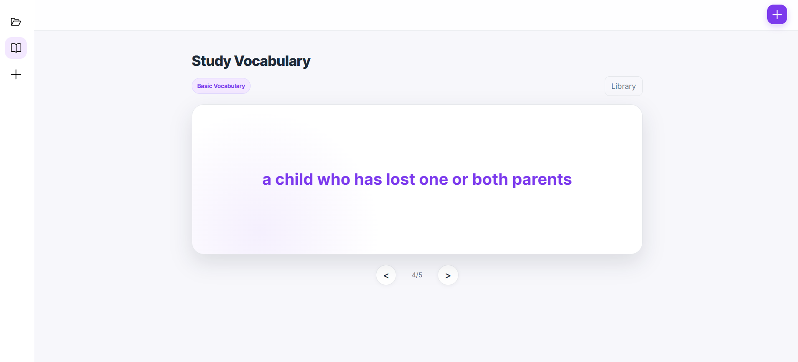

# Vocabulary

A single-page application for managing vocabulary modules and studying them with flashcards.

The project was built to practice modular JavaScript architecture, application state management, DOM manipulation, client-side persistence, form validation, and responsive UI development.

> Live demo: https://vikalca.github.io/vocabulary/

## Preview

### Library

### Create module

### Study mode

## Features

- **Modules library**: Create, delete and manage vocabulary modules.
- **Study mode**: Interactive flashcards with CSS 3D flip animations and dynamic tracking.
- **Draft Editor**: Real-time form validation and draft management.
- **Persistence**: Data is safely synced to **localStorage**.

## Tech stack

- **Core**: Vanilla JavaScript (ES6+), HTML5, CSS3 (Flexbox/Grid, CSS Variables)
- **Build Tool**: Vite
- **Deployment**: GitHub Pages
